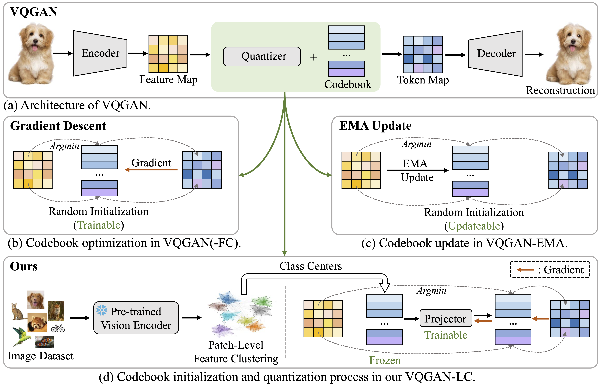

# VQGAN-LC


This is the implementation of the paper ``[Scaling the Codebook Size of VQ-GAN to 100,000 with a Utilization Rate of 99%](https://arxiv.org/pdf/2406.11837)''



## 🔧 Preparation

### Prepare Environment
```bash
pip install -r requirements.txt
```

### Prepare Datasets

Download ImageNet1K dataset and arranged with the following layout:

```
├── /ImageNet1K/
│  ├── /train/
│  ├──  ├── n01440764
│  ├──  ├── n01443537
│  ├──  ├── .........
│  ├── /val/
│  ├──  ├── n01440764
│  ├──  ├── n01440764
│  ├──  ├── .........
```

Download the train/val split of ImageNet1K from our [Google Drive](https://drive.google.com/drive/folders/11mxqPcm8IbbcD6F6DUjufOxcQIXucBcT?usp=sharing).


## 🚗 Runing

### Image Quantization

#### Initialized Codebook Generation

The Initialized codebook should be first downloaded from our [Google Drive](https://drive.google.com/drive/folders/1eTKbOoI8ootxexNgBLs0Dvz-qOdZM21m?usp=sharing) or generate with the following script:
```bash
imagenet_path="IMAGENET PATH"
cd codebook_generation
sh run.sh
```

#### VQGAN-LC Training
Training VQGAN-LC with a codebook size 100K with the following script:

```bash
cd vqgan-gpt-lc
imagenet_path="IMAGENET PATH"
codebook_path="INIT CODEBOOK PATH"
torchrun --nproc_per_node 8 training_vqgan.py \
    --batch_size 256 \
    --image_size 256 \
    --epochs 100 \
    --warmup_epochs 5 \
    --lr 5e-4 \
    --n_class 1000 \
    --imagenet_path $imagenet_path \
    --num_workers 16 \
    --vq_config_path vqgan_configs/vq-f16.yaml \
    --output_dir "train_logs_vq/vqgan_lc_100K" \
    --log_dir "train_logs_vq/vqgan_lc_100K" \
    --disc_start 50000 \
    --n_vision_words 100000 \
    --local_embedding_path $codebook_path \
    --tuning_codebook 0 \
    --use_cblinear 1 \
    --embed_dim 8
```

We provide VQGAN-LC-100K trained for 20 epoches at [Google Drive](https://drive.google.com/drive/folders/12824gtaR_upGH1DJRNfAjQFiw8c1FmwJ?usp=sharing).

#### VQGAN-LC Testing
Testing VQGAN-LC for image quantization with the following script:

```bash
cd vqgan-gpt-lc
imagenet_path="IMAGENET PATH"
codebook_path="INIT CODEBOOK PATH"
vq_path="VQGAN-LC PATH"
torchrun --nproc_per_node 1 eval_reconstruction.py \
        --batch_size 8 \
        --image_size 256 \
        --lr 9e-3 \
        --n_class 1000 \
        --imagenet_path $imagenet_path \
        --vq_config_path vqgan_configs/vq-f16.yaml \
        --output_dir "log_eval_recons/vqgan_lc_100K_f16" \
        --log_dir "log_eval_recons/vqgan_lc_100K_f16" \
        --quantizer_type "org" \
        --local_embedding_path $codebook_path \
        --stage_1_ckpt $vq_path \
        --tuning_codebook 0 \
        --embed_dim 8 \
        --n_vision_words 100000 \
        --use_cblinear 1 \
        --dataset "imagenet"
```

PSNR and SSIM are computed by [pyiqa](https://github.com/chaofengc/IQA-PyTorch). rFID is calculated by [cleanfid](https://github.com/GaParmar/clean-fid).

* * * 
### GPT Generation

#### GPT Training
Training GPT with VQGAN-LC tokenizer (GPT-LC) for class-conditional image generation:

```bash
cd vqgan-gpt-lc
imagenet_path="IMAGENET PATH"
codebook_path="INIT CODEBOOK PATH"
vq_path="VQGAN-LC PATH"
torchrun --nproc_per_node 1 training_gpt.py \
    --batch_size 1024 \
    --image_size 256 \
    --epochs 100 \
    --lr 4.5e-4 \
    --n_class 4 \
    --imagenet_path $imagenet_path \
    --num_workers 16 \
    --vq_config_path vqgan_configs/vq-f16.yaml \
    --local_embedding_path $codebook_path \
    --stage_1_ckpt $vq_path   \
    --n_vision_words 100000 \
    --tuning_codebook 0 \
    --use_cblinear 1 \
    --embed_dim 8 \
    --output_dir "train_logs_gpt/gpt_lc_100K" \
    --deepspeed \
    --deepspeed_config "config/deepspeed_gpt_zero2_small.json" \
    --gpt_type "small"

```

We also provide the checkpoint of GPT-LC on [Google Drive](https://drive.google.com/drive/folders/1DDHYpEKJUeVePIPzLf72DbUZ7Qa9x9yx?usp=sharing).

#### GPT Testing

Evaluating the FID score of 50K generated images with GPT-LC:

```bash
cd vqgan-gpt-lc
imagenet_path="IMAGENET PATH"
codebook_path="INIT CODEBOOK PATH"
vq_path="VQGAN-LC PATH"
gpt_path="GPT-LC PATH"
torchrun --nproc_per_node 1 eval_generation.py \
    --batch_size 50 \
    --image_size 256 \
    --epochs 100 \
    --lr 4.5e-4 \
    --n_class 1000 \
    --imagenet_path $imagenet_path \
    --num_workers 8 \
    --vq_config_path vqgan_configs/vq-f16.yaml \
    --output_dir "log_eval_gpt/gpt_lc_100K_f16" \
    --local_embedding_path $imagenet_path \
    --stage_1_ckpt $vq_path \
    --stage_2_ckpt $gpt_path \
    --n_vision_words 100000 \
    --tuning_codebook 0 \
    --use_cblinear 1 \
    --embed_dim 8 \
    --top_k 100000 \
    --dataset "imagenet" \
    --gpt_type "small"
```
* * * 
### LDM Generation

#### LDM Training

Setting the pathes of ImageNet1K dataset, VQGAN-LC checkpoint and initialized codebook in "config/imagenet-f16-vqgan-lc-100K.yaml". 

Training LDM with VQGAN-LC tokenizer (LDM-LC) for class-conditional image generation:

```bash
cd ldm-lc
python main.py --base configs/imagenet-f16-ours-100K.yaml \
               -t --gpus 0,1,2,3,4,5,6,7, \
               --logdir "./train_logs/ldm_lc_100K_f16"
```

We also provide the LDM-LC checkpoints (training for 100 epoches) with both 256 latent resolution (f16) and 1024 latent resolution (f8) on [Google Drive](https://drive.google.com/drive/folders/1AlqRTJABnxrEKxgLUp-v0O9cnDUnboO5?usp=sharing).

#### LDM Testing

Evaluating the FID score of 50K generated images with LDM-LC:

```bash
cd ldm-lc
imagenet_path="IMAGENET PATH"
ldm_lc_path="LDM-LC PATH"
python run_evaluations.py \
            --times 2 \
            --n_sample 25 \
            --scale 1.6 \
            --edim 8 \
            --resolution 16 \
            --imagenet_path $imagenet_path \
            --ckpt_path $ldm_lc_path \
            --config_path "configs/imagenet-f16-vqgan-lc-100K.yaml" \
            --save_path "test_logs/ldm_lc_100K_f16"
```


* * * 
### DiT Generation

#### DiT Training

Training DiT with VQGAN-LC tokenizer (DiT-LC) for class-conditional image generation:

```bash
cd dit-lc
imagenet_train_path="IMAGENET TRAIN SET PATH"
codebook_path="INIT CODEBOOK PATH"
vq_path="VQGAN-LC PATH"
torchrun --nproc_per_node=8 train.py --model DiT-XL/2 \
                                     --data-path $imagenet_train_path \
                                     --embed_dim 8 \
                                     --n_vision_words 100000 \
                                     --tuning_codebook 0 \
                                     --use_cblinear 1 \
                                     --vq_config_path "vqgan_configs/vq-f16.yaml" \
                                     --local_embedding_path $codebook_path \
                                     --ckpt_path $vq_path \
                                     --global-batch-size 256 \
                                     --latent_size 16 \
                                     --results-dir "train_logs/dit_lc_100K_f16"

```

We also provide the checkpoint of DiT-LC (trained for 400K iterations) on [Google Drive](https://drive.google.com/drive/folders/1nkpd82_Gmbvo77bPOjVjh60_jZDlsbJd?usp=sharing).

#### DiT Testing
Evaluating the FID score of 50K generated images with DiT-LC:

```bash
cd dit-lc
imagenet_train_path="IMAGENET TRAIN SET PATH"
codebook_path="INIT CODEBOOK PATH"
vq_path="VQGAN-LC PATH"
dit_path="DiT-LC PATH"
python evaluation.py --model DiT-XL/2 \
                     --image-size 256 \
                     --num-sampling-steps 250 \
                     --seed 0 \
                     --embed_dim 8 \
                     --n_vision_words 100000 \
                     --local_embedding_path $codebook_path \
                     --vq_ckpt_path $vq_path \
                     --ckpt $dit_path \
                     --tuning_codebook 0 \
                     --use_cblinear 1 \
                     --cfg-scale 8 \
                     --save_dir "test_logs/dit_lc_100K_f16" \
                     --num_sample 50
```

* * * 
### SiT Generation

#### SiT Training

Training DiT with VQGAN-LC tokenizer (SiT-LC) for class-conditional image generation:

```bash
cd sit-lc
imagenet_train_path="IMAGENET TRAIN SET PATH"
codebook_path="INIT CODEBOOK PATH"
vq_path="VQGAN-LC PATH"
torchrun --nproc_per_node=1 train.py --model SiT-XL/2 \
                                     --data-path $imagenet_train_path  \
                                     --embed_dim 8 \
                                     --n_vision_words 100000 \
                                     --tuning_codebook 0 \
                                     --use_cblinear 1 \
                                     --vq_config_path "vqgan_configs/vq-f16.yaml" \
                                     --local_embedding_path $codebook_path \
                                     --ckpt_path $vq_path \
                                     --global-batch-size 256 \
                                     --latent_size 16 \
                                     --results-dir "results/sit_lc_100K_f16"

```

We also provide the checkpoint of SiT-LC (trained for 400K iterations) on [Google Drive](https://drive.google.com/drive/folders/10jORUAWLk7sCmwYgmkjdSA91_iEwYyRV?usp=sharing).

#### SiT Testing
Evaluating the FID score of 50K generated images with SiT-LC:

```bash
cd sit-lc
imagenet_train_path="IMAGENET TRAIN SET PATH"
codebook_path="INIT CODEBOOK PATH"
vq_path="VQGAN-LC PATH"
sit_path="SiT-LC PATH"
python evaluation.py ODE --model SiT-XL/2 \
                         --data-path $imagenet_train_path  \
                         --image-size 256 \
                         --num-sampling-steps 250 \
                         --seed 0 \
                         --embed_dim 8 \
                         --n_vision_words 100000 \
                         --local_embedding_path $codebook_path \
                         --vq_ckpt_path $vq_path \
                         --ckpt $sit_path \
                         --tuning_codebook 0 \
                         --use_cblinear 1 \
                         --cfg-scale 8 \
                         --save_dir "test_logs/sit_lc_100K_f16"

```


## 📏 Checkpoints

### Image Quantization
| Method  | Resolution | Utilization Rate | rFID Score | Checkpoints |
|---------|---------------|----------|----------|----------|
| VQGAN-LC | f16 | 99.9%     | 2.62 | [Google Drive](https://drive.google.com/drive/folders/12824gtaR_upGH1DJRNfAjQFiw8c1FmwJ?usp=sharing)
| VQGAN-LC | f8 | 99.5%     | 1.29 | [Google Drive](https://drive.google.com/drive/folders/12824gtaR_upGH1DJRNfAjQFiw8c1FmwJ?usp=sharing)

### Image Generation
| Method  | Resolution | Utilization Rate | FID Score | Checkpoints |
|---------|---------------|----------|----------|----------|
| GPT-LC | f16 | 97.0%     | 15.4 | [Google Drive](https://drive.google.com/drive/folders/1DDHYpEKJUeVePIPzLf72DbUZ7Qa9x9yx?usp=sharing) |
| DiT-LC | f16 | 99.4%     | 10.8    | [Google Drive](https://drive.google.com/drive/folders/1nkpd82_Gmbvo77bPOjVjh60_jZDlsbJd?usp=sharing) |
| SiT-LC | f16 | 99.6%   | 8.40    | [Google Drive](https://drive.google.com/drive/folders/10jORUAWLk7sCmwYgmkjdSA91_iEwYyRV?usp=sharing)|
| LDM-LC | f16 | 99.4% | 8.36 | [Google Drive](https://drive.google.com/drive/folders/1AlqRTJABnxrEKxgLUp-v0O9cnDUnboO5?usp=sharing) |
| LDM-LC | f8 | 99.4% | 5.06 | [Google Drive](https://drive.google.com/drive/folders/1AlqRTJABnxrEKxgLUp-v0O9cnDUnboO5?usp=sharing) |


## 👨‍🏫 Acknowledgement
This repo is built on [taming-transformers](https://github.com/CompVis/taming-transformers), [latent-diffusion](https://github.com/CompVis/latent-diffusion), [DiT](https://github.com/facebookresearch/DiT), and [SiT](https://github.com/willisma/SiT).

The evaluation tools are used from [pyiqa](https://github.com/chaofengc/IQA-PyTorch) and [cleanfid](https://github.com/GaParmar/clean-fid).

